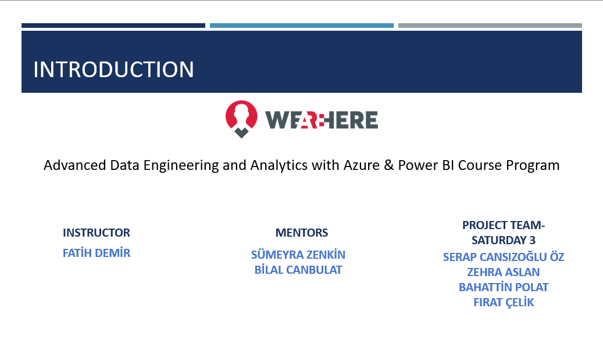

# 🚖 Real-Time Data Pipeline met Microsoft Fabric

---

## Projectoverzicht

Dit project is uitgevoerd als onderdeel van de cursus **Advanced Data Engineering and Analytics met Azure & Power BI**.  
Het doel was het bouwen van een **Uber-achtige real-time datapijplijn** met behulp van **Microsoft Fabric**, die in staat is om streaming data efficiënt te verwerken, transformeren en visualiseren.

De pijplijn is ontworpen volgens de **Medallion Architecture**:
- **Bronze Layer (🥉)** – ruwe data rechtstreeks uit de bron, zonder transformaties.  
- **Silver Layer (🥈)** – opgeschoonde en getransformeerde data, klaar voor analytische verwerking.  
- **Gold Layer (🥇)** – geoptimaliseerde en gecureerde data in een Fabric Warehouse voor rapportages en dashboards.  

Dankzij deze architectuur konden we **datakwaliteit, traceerbaarheid en prestaties** garanderen in elke stap van de pipeline.

---

## Gebruikte Tools

### 🔹 Projectmanagement
- **GitHub** – versiebeheer en samenwerking aan code  
- **Azure DevOps / Trello** – taakbeheer en voortgangsbewaking  
- **Scrum-methodologie** – werken in korte iteraties, continue feedback, duidelijke rolverdeling  

### 🔹 Dataopslag & Ingestie
- **Fabric Lakehouse & Delta Tables** – schaalbare opslag en efficiënte querying  
- **Eventstream & Event House** – real-time data-inname en eventverwerking  

### 🔹 Dataverwerking
- **PySpark** – batch- en streamingtransformaties in de Bronze- en Silver-laag  
- **Dataflow Gen2** – low-code transformaties en dataflows  

### 🔹 Analyse & Visualisatie
- **Fabric Warehouse** – opslag van gecureerde data in de Gold-laag  
- **Power BI** – interactieve dashboards en datavisualisatie  

---

##  Uitdagingen & Oplossingen

- **Beperkte toegang tot Google Drive**  
  ✔ Opgelost met `gdown` voor directe downloads en batchverwerking  
- **Fabric-capaciteitslimieten**  
  ✔ Optimalisatie van resources, geplande batchtaken en monitoring van gebruik  
- **Teamwerk op afstand**  
  ✔ Heldere rolverdeling, continue communicatie en gebruik van Scrum  

---

##  Belangrijkste Leerpunten

- Het belang van **Agile & Scrum** bij remote samenwerking  
- Praktische ervaring met **streaming data processing** en **Medallion Architecture**  
- Meer zelfvertrouwen in **Spark, Fabric, Data Pipelines** en **low-code transformaties**  
- Inzicht in **datamodellering en best practices** voor data-engineering  

---

##  Toekomstige Verbeteringen

- **Opschalen van Fabric-capaciteit** → betere prestaties en schaalbaarheid  
- **Verbeterde datagovernance & security** → toegangsbeheer, auditing en compliance  
- **Snellere queries** → gebruik van V-Order en betere indexeringsstrategieën  
- **AI-gedreven analyses** → voorspellende modellen en automatische besluitvorming  

---

##  Projectteam & Rollen

- **Serap Cansızoğlu Öz** – Data Engineer (data-inname & transformatie)  
- **Zehra Aslan** – Data Analyst (rapportages & Power BI dashboards)  
- **Bahattin Polat** – Data Engineer (PySpark & Dataflow Gen2 transformaties)  
- **Fırat Çelik** – Data Architect (Medallion-architectuur & pipeline design)  

**Mentoren:**  
- Sümeyra Zenkin  
- Bilal Canbulat  

**Instructor:**  
- Fatih Demir  

---

##  Visualisaties

Onderstaande afbeeldingen uit de presentatie tonen de architectuur, workflow en resultaten van dit project:

